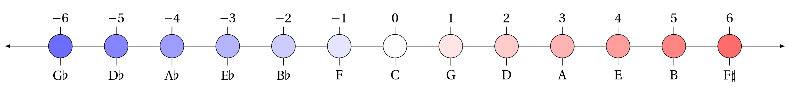
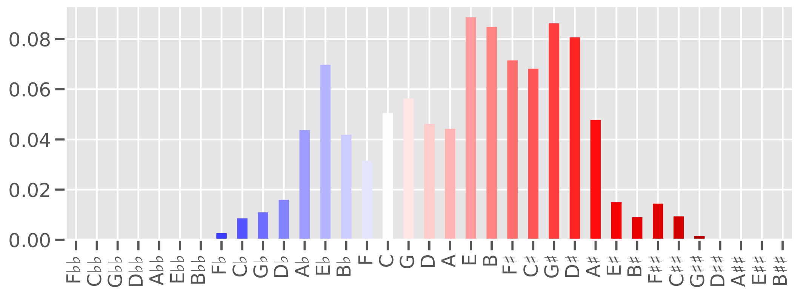

# TP3C corpus (v1.0.0)
[](https://zenodo.org/badge/latestdoi/217256542) <a rel="license" href="http://creativecommons.org/licenses/by/4.0/"></a>

The TP3C ("tonal pitch-class counts corpus") is a dataset of tonal pitch-class counts of Western classical music pieces over a large historical range. It was initially created for [Moss (2019)][https://doi.org/10.5075/epfl-thesis-9808] and will be continuously updated.

_Tonal pitch-classes_ (see [Temperley, 2000](https://onlinelibrary.wiley.com/doi/abs/10.1111/1468-2249.00122), or [Hook, 2007](https://www.tandfonline.com/doi/full/10.1080/17459730701374805), for details) do not distinguish between octaves (e.g. F4 or F5) but express enharmonic differences (e.g. B# and C). They can be arranged on the line of fifths:



In particular, each piece in tonal music can be represented as a distribution of tonal pitch-classes on this line.



_<p align="center">Distribution of tonal pitch-classes of the first movement of Alkan’s ["Concerto for Solo
Piano", op. 39, no. 8](https://www.youtube.com/watch?v=W3XKeqy8xd4)._</p>

This representation of musical tones has implications for computational musicology and music theory, music information retrieval, digital musicology, and music perception and cognition.

### Corpus description

**Overview**

* number of pieces: 2012
* number of composers: 75 composers
* historical range: 1361 - 1942

**Content**

The corpus is given as a tab-separated `.tsv` file with the following columns:

- `composer`: last name of composer
- `composer_first`: first name(s) of composer
- `work_group`: larger collection to which piece belongs (e.g. "Préludes", "Etudes"...)
- `work_catalogue`: work catalogue string like "Op.", "BWV", "KV", etc.
- `opus`: opus no.
- `no`: number, as in "Op. 4, no. 3"
- `mov`: movement number
- `title`: title of piece
- `composition`: date of composition
- `publication`: date of publication
- `source`: abbreviated source from which file and counts were originally obtained (see below)
- `display_year`: unique year per piece; if composition year is not given, publication year is used; if neither is given, the middle of the composer's life is used
- `Fbb` ... `B##`: counts of tonal pitch-classes

**Sources**

The pieces in the corpus come from a variety or resources which are given in the `sources` column. Specifically, these are the [MuseScore](https://musescore.com/) community website, the [Electronic Locator of Vertical Interval Successions (ELVIS)](https://elvisproject.ca/) project, the [Humdrum **kern scores](http://kern.ccarh.org/), the [Choral Public Domain Library (CPDL)](https://www.cpdl.org/). A number of scores have been transcribed by Daniel Bernhardsson for the [Digital and Cognitive Musicology Lab](https://www.epfl.ch/labs/dcml/).

### License

<a rel="license" href="http://creativecommons.org/licenses/by/4.0/"></a><br />This work is licensed under a <a rel="license" href="http://creativecommons.org/licenses/by/4.0/">Creative Commons Attribution 4.0 International License</a>.

Since the corpus contains only the counts of tonal pitch-classes, the original pieces can not be reconstructed from them. The corpus can be freely used for non-commercial purposes, as long as credit is given to the owners, e.g. by [citing the corpus](#Cite) appropriately.

### Versioning

**Policy**

Versioning roughly follows the `vMAJOR.MINOR.PATCH` [semantics](https://semver.org/):

* `PATCHES` include corrections of errors and addition of individual pieces
* `MINOR` updates include inclusion of larger work groups and entire repertoires or other corpora
* `MAJOR` updates are only made if the number of pieces reaches a new order of magnitude

**History**

1. v1.0.0: Initial version; identical to corpus used in [Moss (2019)](https://doi.org/10.5075/epfl-thesis-9808).

#### Contribute

- To report errors, e.g. in composition dates, please create an [issue](https://github.com/DCMLab/tpc_corpus/issues) describing the error.
- Contact me if you want to contribute data
- Also do not hesitate to contact me for further questions: [fabian.moss@epfl.ch](mailto:fabian.moss@epfl.ch)

### Cite
[](https://zenodo.org/badge/latestdoi/217256542)

Finally, if you use the corpus in a research project, please reference it as:

Moss, F. C., Neuwirth, M., Rohrmeier, M. (2020). _TP3C_ (Version 1.0.0) [Data set]. Zenodo. http://doi.org/10.5281/zenodo.3600081

```bibtex
@dataset{tpc_corpusv1.0.0,
  author       = {Fabian C. Moss and
                  Markus Neuwirth and
                  Martin Rohrmeier},
  title        = {TP3C (Version 1.0.0) [Data set]},
  year         = {2020},
  publisher    = {Zenodo},
  doi          = {10.5281/zenodo.3600081},
  url          = {https://github.com/DCMLab/TP3C}
}
```
